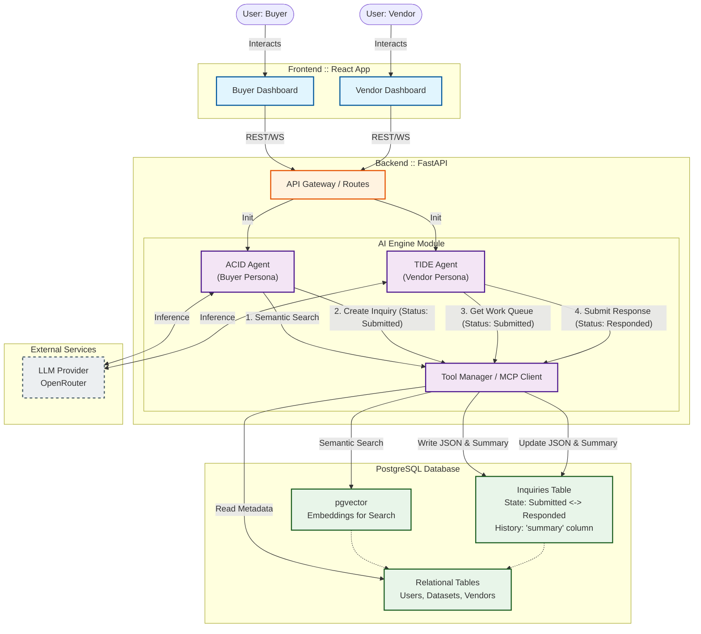

# 🏗️ Puddle Data Marketplace

A two-sided AI-powered marketplace connecting data buyers with data vendors through intelligent agents (ACID for buyers, TIDE for vendors).

---

## 📊 Architecture Overview



---

# 🎬 Demo Video

Check out our demo video to see Puddle in action:

[](VIDEO_URL_HERE)

---

# 🛠️ Local Development Setup Guide

This guide will walk you through setting up the **backend**, **database**, and **frontend** for local development and testing.

---

## 📦 1. Install Required Tools

### **PostgreSQL & PgAdmin**

You will need a PostgreSQL database for the backend.

1. Install PostgreSQL and PgAdmin (if you want a GUI).
2. Open PgAdmin and create a **new database** for testing (e.g., `puddle_test`).

---

## 🗄️ 2. Initialize the Database

1. Locate the database initialization script:

   ```
   backend/extras/database-creation-script.sql
   ```
2. In PgAdmin, open the SQL query tool for your test database.
3. Run the SQL script to automatically create all **tables**, **indexes**, and **triggers**.

---

## 📁 3. Clone the Repository

```bash
git clone https://github.com/Dhruv-Limbani/puddle-backend.git
cd puddle-backend
```

---

## 🐍 4. Setup the Backend Environment

### **Install uv (Python package & environment manager)**

Installation guide:
[https://docs.astral.sh/uv/getting-started/installation/](https://docs.astral.sh/uv/getting-started/installation/)

### **Create a virtual environment**

```bash
uv venv
```

### **Install all Python dependencies**

```bash
uv sync
```


---

## 🔐 5. Create the `.env` File

Create a `.env` file in the **project root directory** and add the following keys:

```
DATABASE_URL=postgresql+asyncpg://<user>:<password>@localhost:<port>/<database_name>
GEMINI_API_KEY=
SECRET_KEY=
ALGORITHM=
ACCESS_TOKEN_EXPIRE_MINUTES=
```

Make sure to replace the placeholders in `DATABASE_URL` with your actual database credentials.

---

## 🚀 6. Start the Backend Server

Run:

```bash
uvicorn app.main:app --reload --port 8000
```

Your backend will now be available at:
**[http://localhost:8000](http://localhost:8000)**

---

# 🎨 Frontend Setup

## 📂 1. Navigate to the frontend directory

```bash
cd frontend
```

## 📦 2. Install dependencies

```bash
npm install
```

## 🚀 3. Start the development server

```bash
npm run dev -- --port 8001
```

Your frontend should now be running on the port 8001 displayed in the terminal

---

# ✅ You’re Ready to Go!

The project should now be fully set up:

* Backend running at **[http://localhost:8000](http://localhost:8000)**
* Frontend running at **[http://localhost:8001](http://localhost:8001)**
* Database initialized and connected

Here is an updated version of the README section with your note added clearly and naturally:

---

# 🛠️ Local Development Setup Guide

This guide will walk you through setting up the **database**, **backend**, and **frontend** for local development and testing.

---

# ⚠️ Important Note!

Before running any part of the project:

* **Make sure your PostgreSQL database server is running.**
* **Start the backend next.**
* **Start the frontend last.**

If you see **“connection refused”** or **database connection errors**, it almost always means one of these services is not running.
Double-check that:

* PostgreSQL server is active
* Backend is running without errors
* Frontend is running and pointing to the correct backend URL


Test buyer: jack.bennett@amazon-retail.com
Test vendor: sales@ecomanalytics.io