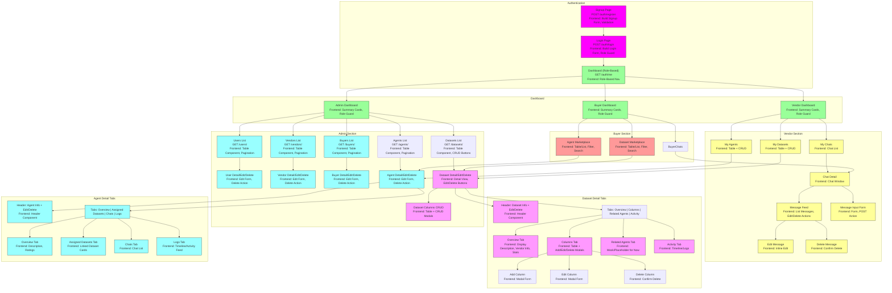

```mermaid
flowchart TD
    %% =====================
    %% Authentication Pages
    %% =====================
    subgraph Auth ["Authentication"]
        Login["Login Page<br>POST /auth/login<br>Frontend: Build Login Form, Role Guard"]
        Signup["Signup Page<br>POST /auth/register<br>Frontend: Build Signup Form, Validation"]
        Login --> Dashboard
        Signup --> Login
    end

    %% =====================
    %% Dashboard Pages
    %% =====================
    subgraph Dash ["Dashboard"]
        Dashboard["Dashboard (Role-Based)<br>GET /auth/me<br>Frontend: Role-Based Nav"]
        Dashboard --> AdminDash
        Dashboard --> VendorDash
        Dashboard --> BuyerDash
    end

    %% =====================
    %% Admin Pages
    %% =====================
    subgraph Admin ["Admin Section"]
        AdminDash["Admin Dashboard<br>Frontend: Summary Cards, Role Guard"]
        AdminDash --> UsersList
        AdminDash --> VendorsList
        AdminDash --> BuyersList
        AdminDash --> DatasetsList
        AdminDash --> AgentsList

        UsersList["Users List<br>GET /users/<br>Frontend: Table Component, Pagination"]
        VendorsList["Vendors List<br>GET /vendors/<br>Frontend: Table Component, Pagination"]
        BuyersList["Buyers List<br>GET /buyers/<br>Frontend: Table Component, Pagination"]
        DatasetsList["Datasets List<br>GET /datasets/<br>Frontend: Table Component, CRUD Buttons"]
        AgentsList["Agents List<br>GET /agents/<br>Frontend: Table Component, Pagination"]

        UsersList --> UserDetail
        VendorsList --> VendorDetail
        BuyersList --> BuyerDetail
        DatasetsList --> DatasetDetail
        DatasetDetail --> DatasetColumns
        AgentsList --> AgentDetail

        UserDetail["User Detail/Edit/Delete<br>Frontend: Edit Form, Delete Action"]
        VendorDetail["Vendor Detail/Edit/Delete<br>Frontend: Edit Form, Delete Action"]
        BuyerDetail["Buyer Detail/Edit/Delete<br>Frontend: Edit Form, Delete Action"]
        DatasetDetail["Dataset Detail/Edit/Delete<br>Frontend: Detail View, Edit/Delete Buttons"]
        DatasetColumns["Dataset Columns CRUD<br>Frontend: Table + CRUD Modals"]
        AgentDetail["Agent Detail/Edit/Delete<br>Frontend: Edit Form, Delete Action"]
    end

    %% =====================
    %% Vendor Pages
    %% =====================
    subgraph Vendor ["Vendor Section"]
        VendorDash["Vendor Dashboard<br>Frontend: Summary Cards, Role Guard"]
        VendorDash --> VendorDatasets
        VendorDash --> VendorAgents
        VendorDash --> VendorChats

        VendorDatasets["My Datasets<br>Frontend: Table + CRUD"]
        VendorAgents["My Agents<br>Frontend: Table + CRUD"]
        VendorChats["My Chats<br>Frontend: Chat List"]

        VendorDatasets --> DatasetDetail
        VendorAgents --> AgentDetail
        VendorChats --> ChatDetail

        ChatDetail["Chat Detail<br>Frontend: Chat Window"]
        ChatDetail --> ChatFeed
        ChatDetail --> ChatInput

        ChatFeed["Message Feed<br>Frontend: List Messages, Edit/Delete Actions"]
        ChatInput["Message Input Form<br>Frontend: Form, POST Action"]
        ChatFeed --> EditMsg
        ChatFeed --> DeleteMsg

        EditMsg["Edit Message<br>Frontend: Inline Edit"]
        DeleteMsg["Delete Message<br>Frontend: Confirm Delete"]
    end

    %% =====================
    %% Buyer Pages
    %% =====================
    subgraph Buyer ["Buyer Section"]
        BuyerDash["Buyer Dashboard<br>Frontend: Summary Cards, Role Guard"]
        BuyerDash --> DatasetMarketplace
        BuyerDash --> AgentMarketplace
        BuyerDash --> BuyerChats

        DatasetMarketplace["Dataset Marketplace<br>Frontend: Table/List, Filter, Search"]
        AgentMarketplace["Agent Marketplace<br>Frontend: Table/List, Filter, Search"]
        BuyerChats --> ChatDetail

        DatasetMarketplace --> DatasetDetail
        AgentMarketplace --> AgentDetail
    end

    %% =====================
    %% Dataset Detail Tabs
    %% =====================
    subgraph DatasetTabs ["Dataset Detail Tabs"]
        DatasetDetail --> DHeader["Header: Dataset Info + Edit/Delete<br>Frontend: Header Component"]
        DatasetDetail --> DTabs["Tabs: Overview | Columns | Related Agents | Activity"]

        DTabs --> DOverview["Overview Tab<br>Frontend: Display Description, Vendor Info, Stats"]
        DTabs --> DColumns["Columns Tab<br>Frontend: Table + Add/Edit/Delete Modals"]
        DColumns --> AddCol["Add Column<br>Frontend: Modal Form"]
        DColumns --> EditCol["Edit Column<br>Frontend: Modal Form"]
        DColumns --> DeleteCol["Delete Column<br>Frontend: Confirm Delete"]
        DTabs --> DRelAgents["Related Agents Tab<br>Frontend: Mock/Placeholder for Now"]
        DTabs --> DActivity["Activity Tab<br>Frontend: Timeline/Logs"]
    end

    %% =====================
    %% Agent Detail Tabs
    %% =====================
    subgraph AgentTabs ["Agent Detail Tabs"]
        AgentDetail --> AHeader["Header: Agent Info + Edit/Delete<br>Frontend: Header Component"]
        AgentDetail --> ATabs["Tabs: Overview | Assigned Datasets | Chats | Logs"]

        ATabs --> AOverview["Overview Tab<br>Frontend: Description, Ratings"]
        ATabs --> AAssigned["Assigned Datasets Tab<br>Frontend: Linked Dataset Cards"]
        ATabs --> AChats["Chats Tab<br>Frontend: Chat List"]
        ATabs --> ALogs["Logs Tab<br>Frontend: Timeline/Activity Feed"]
    end

    %% =====================
    %% Styling Classes
    %% =====================
    classDef auth fill:#f0f,stroke:#333,stroke-width:1px;
    classDef dashboard fill:#9f9,stroke:#333,stroke-width:1px;
    classDef admin fill:#9ff,stroke:#333,stroke-width:1px;
    classDef vendor fill:#ff9,stroke:#333,stroke-width:1px;
    classDef buyer fill:#f99,stroke:#333,stroke-width:1px;
    classDef dataset fill:#f9f,stroke:#333,stroke-width:1px;
    classDef agent fill:#9ff,stroke:#333,stroke-width:1px;
    classDef chat fill:#ff9,stroke:#333,stroke-width:1px;

    class Login,Signup auth;
    class Dashboard,AdminDash,VendorDash,BuyerDash dashboard;
    class UsersList,UserDetail,VendorsList,VendorDetail,BuyersList,BuyerDetail admin;
    class VendorDatasets,VendorAgents,VendorChats vendor;
    class DatasetMarketplace,AgentMarketplace buyer;
    class DatasetDetail,DatasetColumns,DHeader,DOverview,DColumns,DRelAgents,DActivity dataset;
    class AgentDetail,AHeader,ATabs,AOverview,AAssigned,AChats,ALogs agent;
    class ChatDetail,ChatFeed,ChatInput,EditMsg,DeleteMsg chat;
```